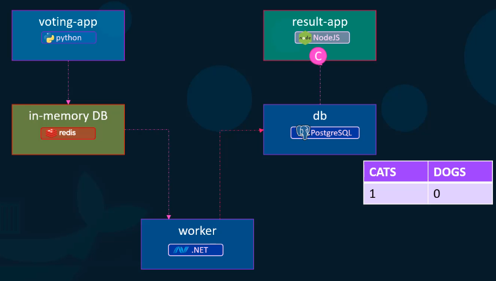
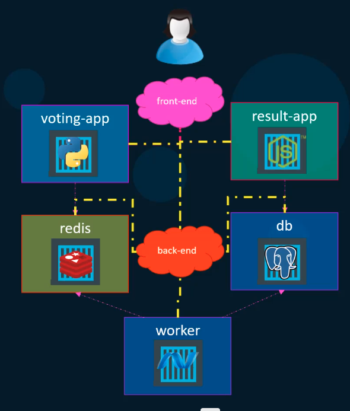

####Docker Compose
```docker run mongodb```
```docker run redis:alpine```
```docker run ansible```
#####docker-compose.yml
```
services:
    database:
       image: "mongodb"
    messaging:
       image: "redis:alpine"
    orchestration:
       image: : "ansible"
```

```docker-compose up```

####Sample application - voting application



```
docker run -d --name=redis redis
docker run -d --name=db postgres
docker run -d --name=vote -p 5000:80 viting-app
docker run -d --name=result -p 5oo1:80 result-app
docker run -d --name=worker worker
```
####docker run --links

```
docker run -d --name=redis redis
docker run -d --name=db postgres
docker run -d --name=vote -p 5000:80 --link redis:redis voting-app
docker run -d --name=result -p 5001:80 --link db:db result-app
docker run -d --name=worker --link db:db --link redis:redis worker
```
#####docker-compose.yml
```
redis:
 image: redis
db:
 image: postgres:9.4
vote:
 image: voting-app  ### build: ./vote
 ports:
   - 5000:80
 links:
   -redis
result:
  image: result-app
  ports:
     - 5001:80
  links:
     - db
worker:
  image: worker
  links:
     - redis
     - db
```
> build option will build application image then run 
> link will create the hostname entry inside the container 
#####docker-compose.yml
```
version: 2
services:
   redis:
    image: redis
   db:
    image: postgres:9.4
   vote:
    image: voting-app  ### build: ./vote
    ports:
      - 5000:80
    depends_on:
      - redis
   result:
     image: result-app
     ports:
        - 5001:80
     depends_on:
        - db
   worker:
     image: worker
     depends_on:
        - redis
        - db
```

> Services will create the seperate network bridge application can communicate between eachother , so link is not requried


#####docker-compose.yml
```
version: 2
services:
   redis:
    image: redis
    networks:
        - back-end

   db:
    image: postgres:9.4
    networks:
       - back-end
   vote:
    image: voting-app  ### build: ./vote
    ports:
      - 5000:80
    networks:
       - front-end
       - back-end
    depends_on:
      - redis
   result:
     image: result-app
     ports:
        - 5001:80
     networks:
        - frontend
        - back-end
     depends_on:
        - db
   worker:
     image: worker
     depends_on:
        - redis
        - db
networks:
 front-end:
 back-end:
```
> network keyword provide the network isolation option