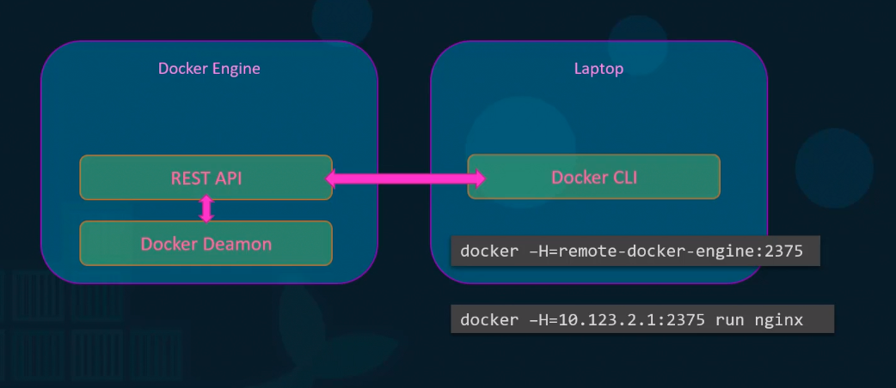
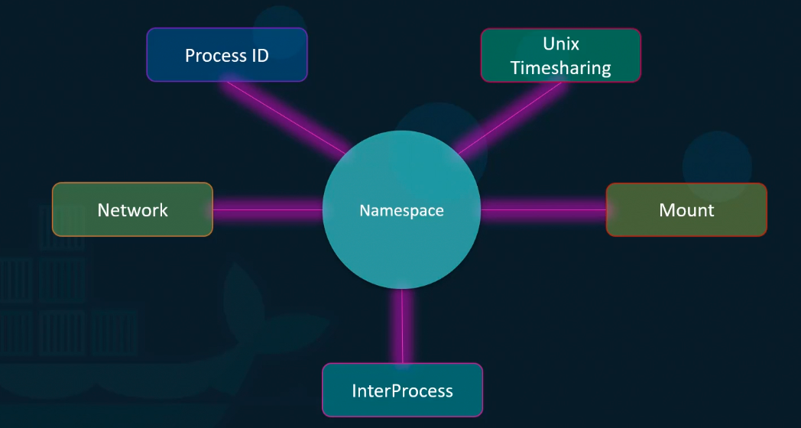
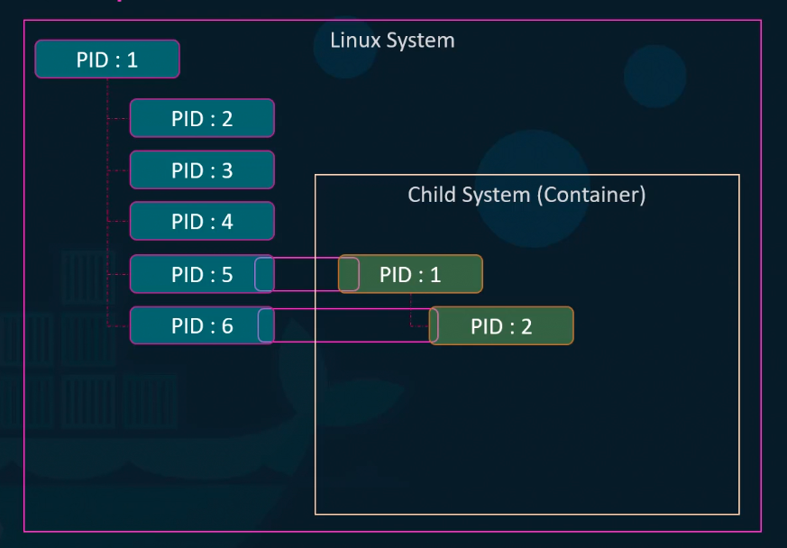
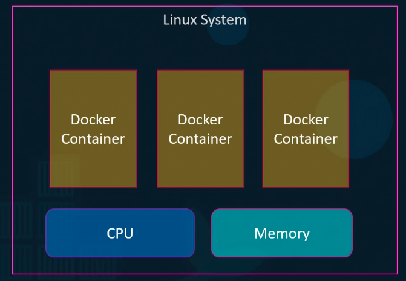

####Docker Engine

#####Containerization

#####Namespace-PID

#####cgroups

```
docker run --cpu=.5 ubuntu
docker run --memory=100m ubuntu
```
> --cpu and -- memory set the usage limit of cpu and memory 

