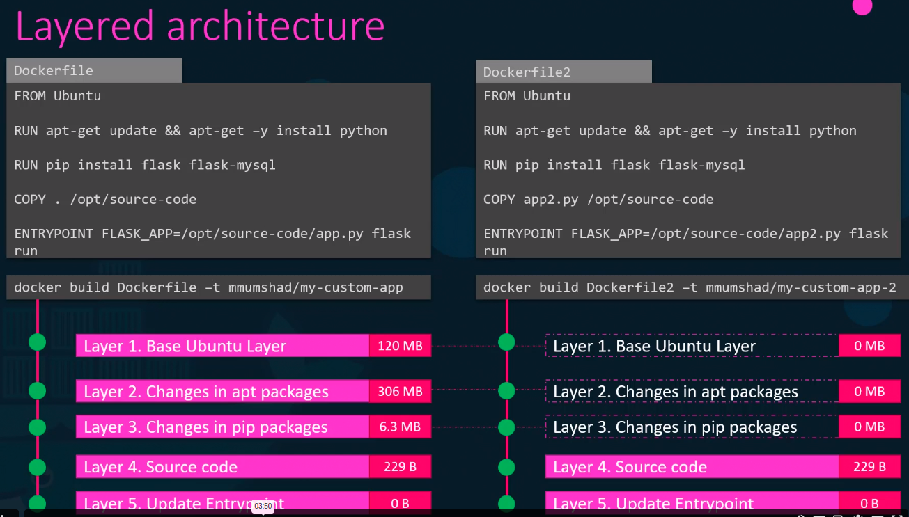
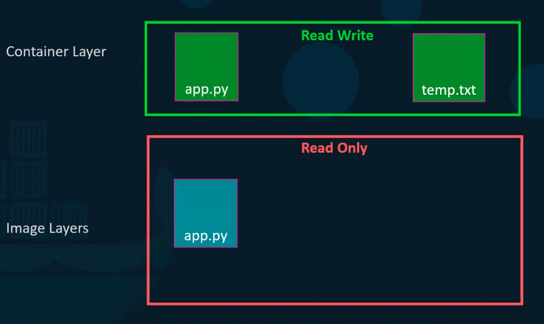
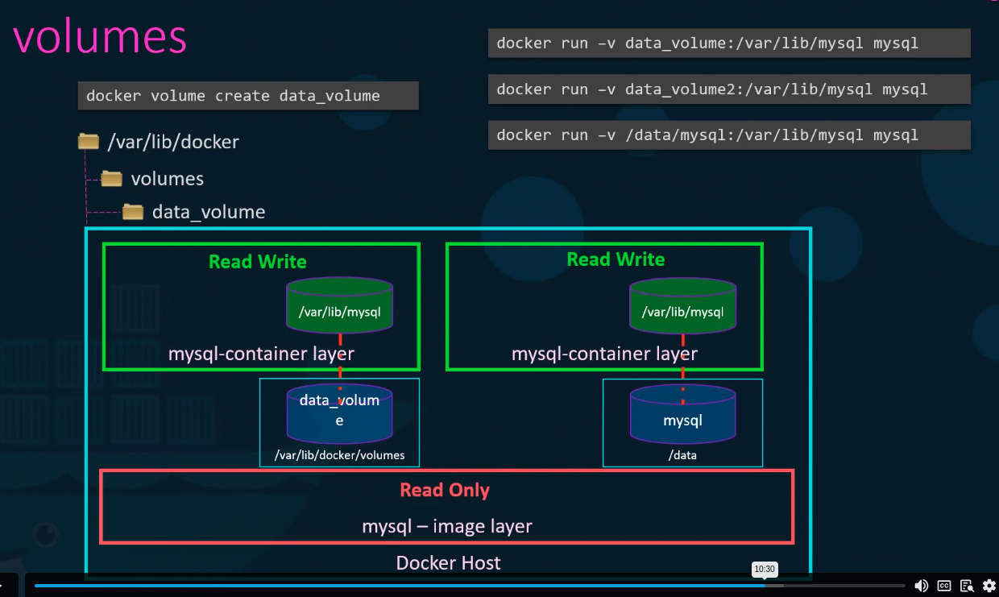

#### Docker Stroage
##### File System
  */var/lib/docker
  |
  |--aufs
  |-- containers
  |--image
  |--volumes

#### Layered Architecture

##### COPY ON WRITE

> container layer is temp layer . once container delete , it will deleted

#### Volume mount
```docker volume create data_volume```
```docker run -v data_volume:/var.lib/mysql mysql```
#### Bind Mount
```docker run -v /data/mysql:/var/lib/mysql mysql```

```
docker run --mount type=bind,source=/data/mysql,target=/var/lib/mysql mysql
```
> In Bind mount use to mount the exiting volume to contianer



#### Stroage driver
1.AUFS
2.ZFS
3.BTRFS
4.Device mapper
5.Overlay
6.Overlay2