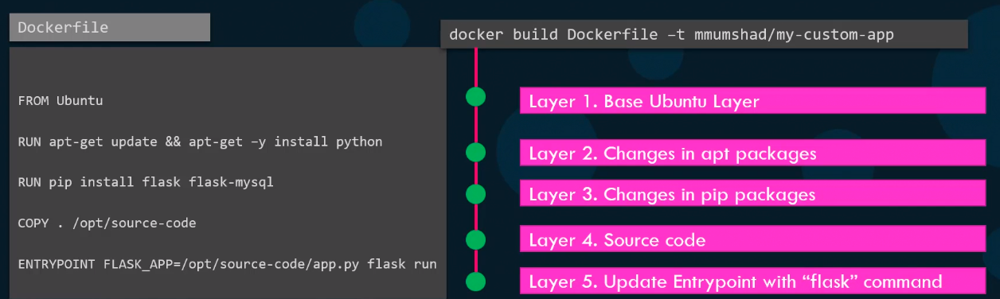

#### Docker Image

##### How to create my own image 
> 1.OS - Ubuntu
> 2. Update apt repo
> 3. Install dependencies using apt
> 4. Install python dependenices using pip
> 5. Copy source code to /opt folder
> 6. Run the web server using "flask" command  

###### Dockerfile
```
FROM Ubuntu
RUN apt-get update
RUN aptget install python
RUN pip install flask
RUN pip install flask-mysql
COPY . /opt/source-code
ENTRYPOINT FLASK_APP=/opt/source-code/app.py flask run
```
> Docker file  format
> Instruction Argument


```docker build Dockerfile -t < image name >```
```docker push < image name >```

#### Layered Architecture


```docker history < image name >```
> on rebuild only new change will be build other remains same.


