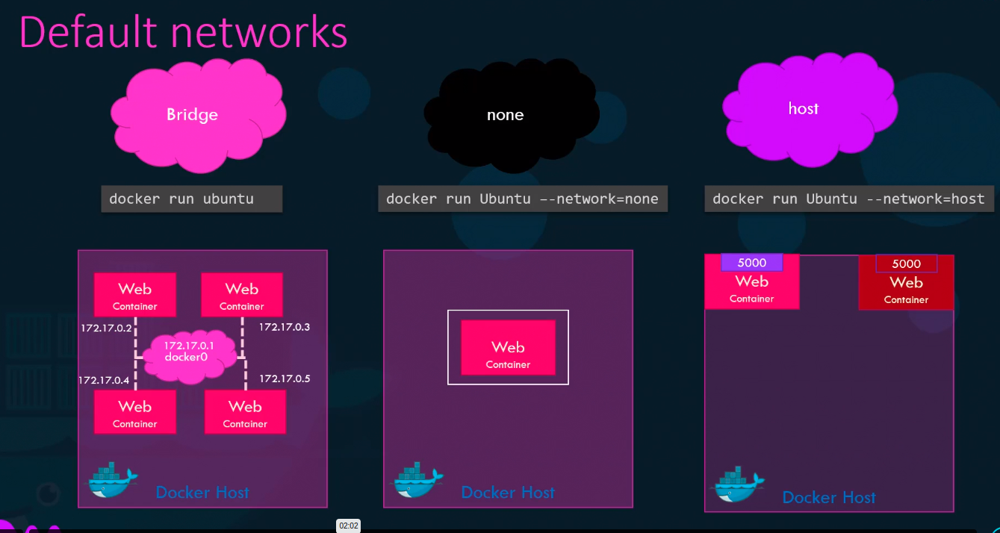
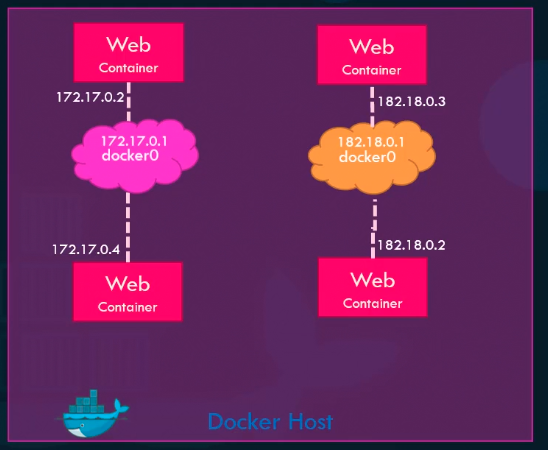
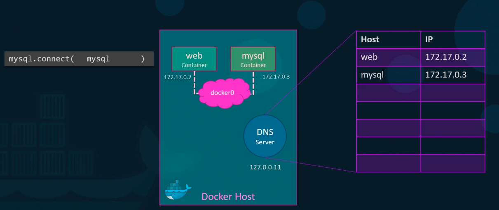

####Docker Network

#### User-defined networks
```
docker network create \
  --driver bridge \
  --subent 182.18.0.0/16
  custom-isolated-network
```
List Docker Network
```docker network ls```



#####Inspect network
```docker inspect <container id></container>```

#####Embedded DNS
