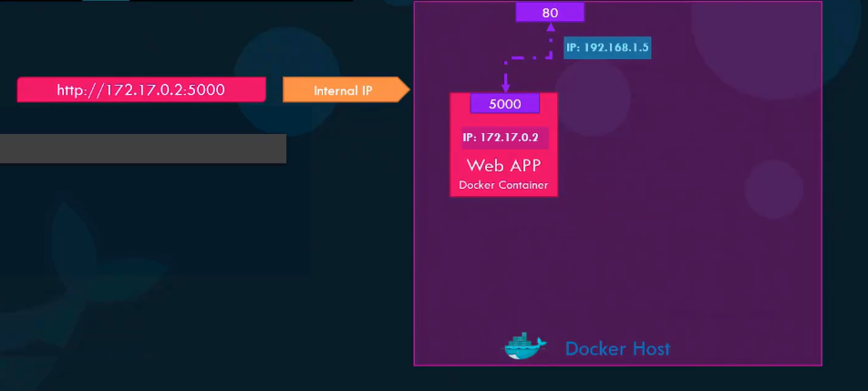

###Docker Run

#####Run -tag
```docker run  <image>```
> if tag is not mentioned , it will automatically takes the latest

```docker run <image>:<tag>```

#####Run- Interactive terminal

```docker run -i < image name >```
> -i  will provide the options  input value on interactive mode

```docker run -it < image name > ```
> -it will provide the interactive terminal mode 


#####Run - PORT mapping

```
docker run < image name>
* Running on http://0.0.0.0:5000:/ (press CTRL+C to quit)
```

``` docker run -p 80 :5000 < image name> ```


##### Run - Volume mapping

```docker -v /opt/datadir:/var/lib/mysql mysql```
```docker -v < host dir > : < docker container dir path>  < image name > ```
> All the data will be stored in docker host machine directory


##### InspectContainer
```docker inspect <container name or id></container>```

> it will provide container details like network and volume mount etc..,
##### Container Logs
```docker logs < container image or id >```
> it will show the std out logs

##### Run commands

```docker run ubuntu cat /etc/os-release```

```docker run ubuntu sleep 15```
```docker run timer```
